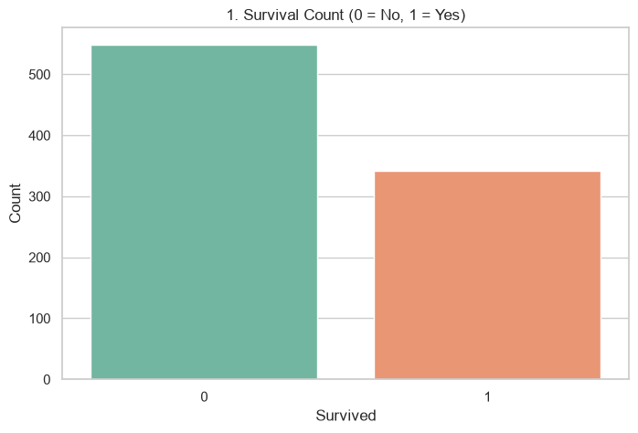
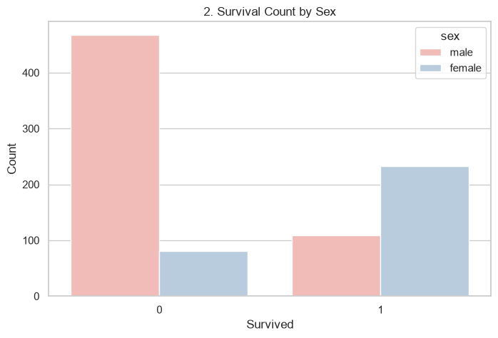
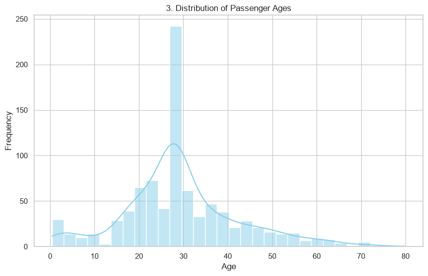
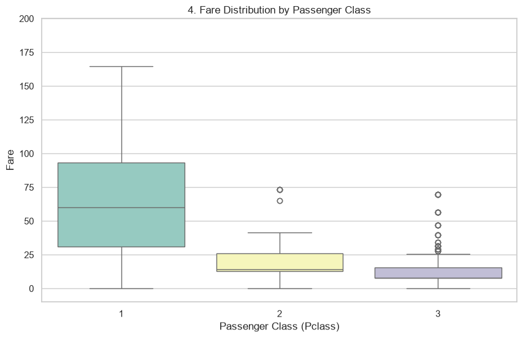
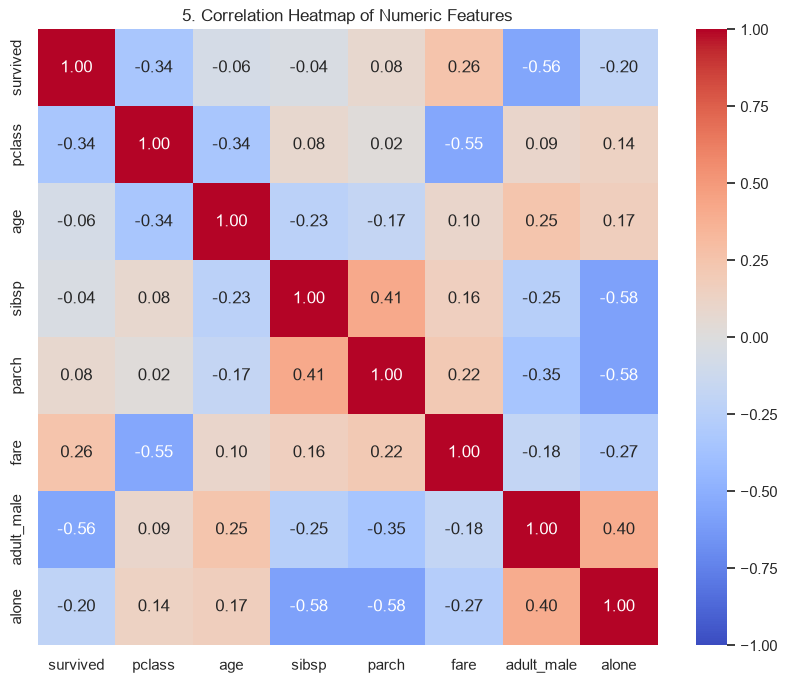

ve # Exploratory Data Analysis (EDA) Report: Titanic Dataset

## 1. Introduction
This report documents the Exploratory Data Analysis (EDA) performed on the widely known **Titanic dataset**. The objective is to understand the data distribution, handle missing values, and extract meaningful insights regarding passenger survival.

## 2. Data Cleaning & Preprocessing
Upon initial inspection, the dataset contained 891 rows and 15 columns. Several columns had missing values:
- **`age`**: 177 missing values. We imputed these using the **median** age (28.0) to avoid the influence of outliers.
- **`deck`**: 688 missing values. Since the majority of the data was missing, this column was **dropped** entirely.
- **`embarked` / `embark_town`**: 2 missing values. These were filled with the **mode** (most frequent value).

After cleaning, the dataset has 0 missing values across all remaining columns.

## 3. Visualizations and Key Findings

### 3.1. Overall Survival Rate

**Finding:** The overall survival rate was quite low. Out of 891 passengers, only about 38% (~342 passengers) survived the disaster, while the majority did not.

### 3.2. Survival by Sex

**Finding:** There is a stark contrast in survival rates between genders. Females had a significantly higher survival rate compared to males, reflecting the "women and children first" maritime protocol.

### 3.3. Age Distribution

**Finding:** The age of the passengers is mostly normally distributed with a slight right skew. The majority of passengers were young adults between the ages of 20 and 35. A notable peak exists for young children (toddlers/infants).

### 3.4. Fare by Passenger Class

**Finding:** First-class passengers (Pclass 1) paid significantly higher fares, with a wider spread of ticket prices and several high-priced outliers. Third-class passengers (Pclass 3) paid the lowest fares, which were densely clustered at the lower end of the scale. 

### 3.5. Feature Correlations

**Finding:** The correlation heatmap indicates key relationships between variables:
- **`survived` and `pclass`**: Negative correlation, meaning lower class numbers (like 1st class) had a higher chance of survival.
- **`survived` and `fare`**: Positive correlation, suggesting those who paid more (typically 1st class) had higher survival rates.
- **`parch` and `sibsp`**: Positive correlation, indicating that passengers traveling with siblings/spouses were also likely traveling with parents/children (family units).

## 4. Conclusion
The EDA reveals that socio-economic status (represented by ticket class and fare) and gender were major factors in determining a passenger's likelihood of surviving the Titanic disaster. The dataset is now fully cleaned and ready for any downstream machine learning modeling.

## 5. MongoDB and Localhost Integration
The cleaned dataset is saved to MongoDB in the database `eda_db` and collection `titanic_cleaned`. A Flask app has been provided to serve the dashboard and the computed data locally.

- Start MongoDB locally.
- Run the EDA pipeline: `python eda.py`
- Run the Flask app: `python app.py`
- Open `http://127.0.0.1:5000` in your browser.

This setup ensures the cleaned Titanic dataset is persistent, queryable, and accessible via a local web interface.
